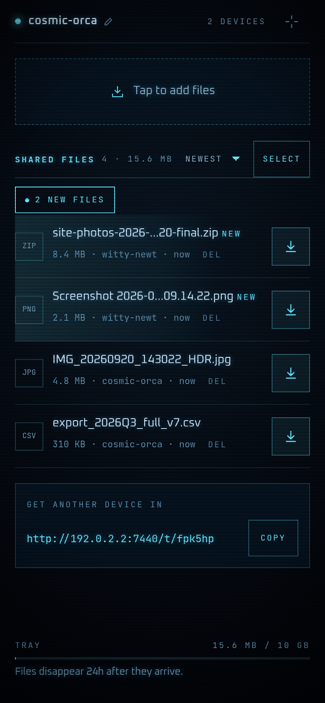
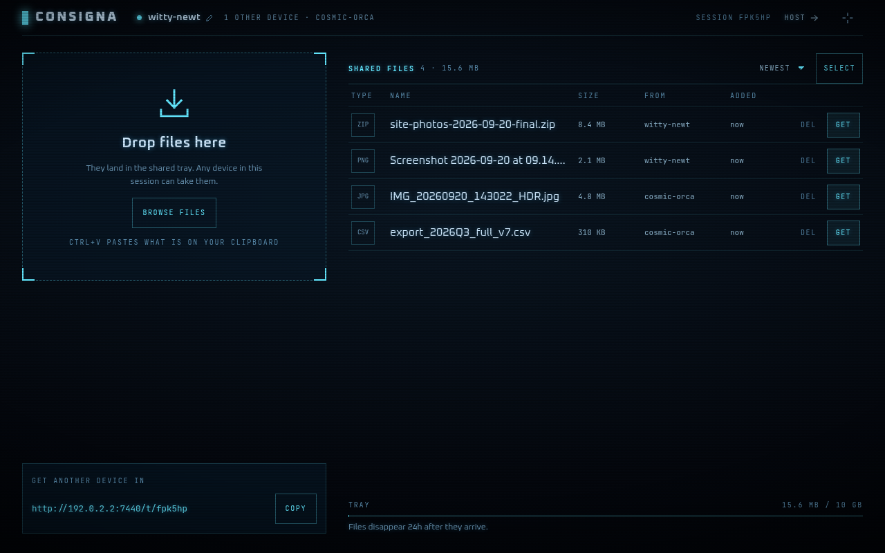
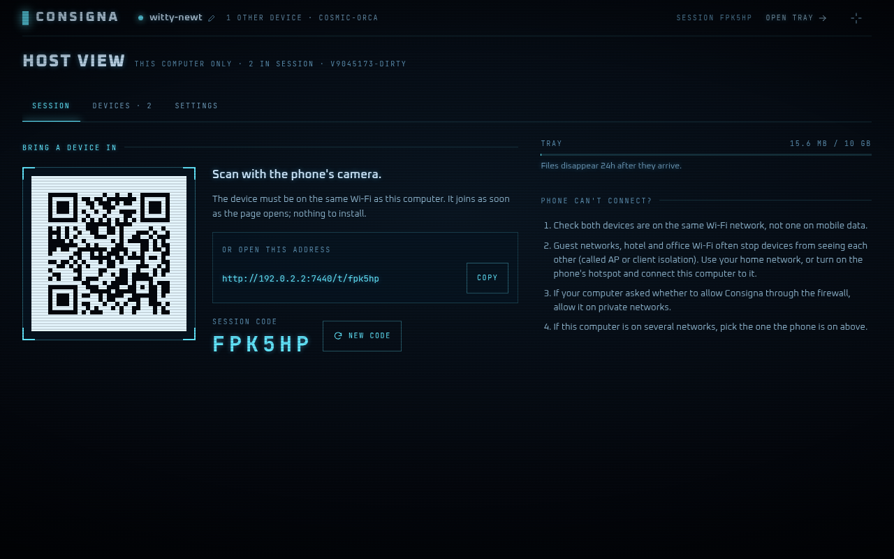

# Consigna

**Private, AirDrop-style file sharing for every device on your network.** Run one small program on a computer; open the link or scan the QR code it shows on your phone, tablet or another laptop; drop files into a shared tray and take them from any device. Nothing to install on the other devices, no accounts, no cloud, and every file disappears on its own.

<p align="center">
  
  &nbsp;
  
</p>

*Consigna* is Spanish for a left-luggage office: you leave something, someone picks it up, and it does not stay there forever.

## Features

- **Any device with a browser.** Phones, tablets, laptops; iOS, Android, macOS, Windows, Linux.
- **Big files that survive bad Wi-Fi.** Uploads are resumable ([tus](https://tus.io) protocol): if a phone locks or the network drops, the transfer pauses and carries on from the last byte, on its own. No size limit per file.
- **Live.** Files appear on every device the moment they arrive; you see who else is in the session.
- **Temporary by design.** Files expire (24 hours by default), the tray has a size cap (10 GB by default), and everything is deleted when Consigna stops.
- **Several files at once** as a ZIP streamed straight to the download, no waiting for it to be built.
- **Host view** on the computer running Consigna: QR code, network picker, connected devices with their IP addresses, the tray limits, and a button to end the session.
- **Private.** Only devices with the session link or code get in. No internet access needed or used; fonts and everything else ship inside the binary.
- **One small binary**, no dependencies, no database.

## Quick start

1. Download the binary for your system from the [releases page](https://github.com/EymanEP/consigna/releases), or [build it](#build-from-source).
2. Run it:

   ```sh
   ./consigna
   ```

   It prints a link and a QR code:

   ```text
     ▌ CONSIGNA  v0.1.0
       LOCAL SESSION // NO INTERNET // 9FQ2XK

     Open on your other devices (same Wi-Fi):
       http://192.168.1.47:7431/t/9fq2xk   (en0)

     Host view (this computer only): http://localhost:7431/host
   ```

3. Scan the QR code with your phone's camera (or open the link). You are in. Open the host view on the computer to see the QR code in a browser, manage devices and change the limits.

The first time, your operating system may ask whether to let Consigna accept network connections. Allow it on private networks. On Linux the firewall does not ask, it silently blocks other devices: if they cannot connect, [open the port for your network](docs/self-hosting.md#linux-firewalls).

<p align="center"></p>

## Options

Every flag can also be set as an environment variable: `CONSIGNA_` plus the flag name in capitals, e.g. `CONSIGNA_PORT=8080`.

| Flag | Default | What it does |
| --- | --- | --- |
| `--port` | `7431` | TCP port to listen on. |
| `--bind` | `0.0.0.0` | Address to listen on. `127.0.0.1` keeps it to this computer. |
| `--tray-limit` | `10GB` | Maximum size of the tray for this run (files plus uploads in progress). |
| `--ttl` | `24h` | How long a file stays, e.g. `90m`, `24h`, `7d`. |
| `--data-dir` | per-user cache dir | Where files are kept while Consigna runs. |
| `--settings` | per-user config dir | Where the limits changed in the host view are saved. |
| `--no-settings-file` | off | Do not read or save a settings file. |
| `--allow-host` | none | Extra host names allowed in URLs, e.g. `laptop.local`. |
| `--trust-loopback` | `true` | Treat browsers on this computer as the host. Turn off behind a reverse proxy. |
| `--no-qr` | off | Do not print the QR code in the terminal. |
| `--log-level` / `--log-format` | `info` / `text` | Logging; `json` for machines. |

Limits changed in the host view are saved and used on the next start; `--tray-limit` and `--ttl` override them for one run.

## How it works

```text
 phone / laptop browsers                   the host computer
 ┌─────────────────┐     your LAN      ┌──────────────────────────────────┐
 │ web UI          │ ────────────────▶ │ consigna (one Go binary)         │
 │  tus uploads    │   HTTP /api/v1    │  sessions · uploads · downloads  │
 │  live updates   │ ◀──────────────── │  live updates · tray on disk     │
 └─────────────────┘  Server-Sent Ev.  └──────────────────────────────────┘
```

A Go server keeps the tray in a private directory on the host and pushes the tray's state to every browser over Server-Sent Events. The React UI is built into the binary. Details: [docs/architecture.md](docs/architecture.md), [docs/api.md](docs/api.md).

## Security and privacy

Consigna is meant for networks you trust, like your home Wi-Fi. Joining needs the session link or code; wrong codes are rate-limited; the host can rotate the code, remove devices or end the session. Uploaded files are never shown inside the app, only downloaded, so a malicious file cannot attack other devices through Consigna. Traffic on the LAN is plain HTTP, like most local tools; see [docs/security.md](docs/security.md) for the full model and its limits, and [SECURITY.md](SECURITY.md) to report a vulnerability.

## Build from source

You need Go 1.24+ and Node.js 20.19+.

```sh
git clone https://github.com/EymanEP/consigna.git
cd consigna
make build        # builds the UI and bin/consigna with it embedded
./bin/consigna
```

`go install` alone builds the server without the UI (it is not committed), so use `make build` or a release.

## Development

```sh
make dev     # Go server on :7431 + Vite dev server with hot reload on http://localhost:5173
make test    # Go (with the race detector) and web unit tests
make lint    # golangci-lint, TypeScript, ESLint, Prettier
make e2e     # Playwright tests: a host and a phone, against the real binary
make check   # everything CI runs
```

See [CONTRIBUTING.md](CONTRIBUTING.md) for the code layout and conventions.

## Roadmap

- [x] LAN sharing with resumable uploads, live tray, host view
- [ ] Optional HTTPS on the LAN (self-signed or your own certificate)
- [ ] Running on a VPS or home server reachable from the internet: long access tokens, host approval of new devices, TLS, Docker guide ([plan](docs/self-hosting.md))
- [ ] End-to-end encryption in the browser, so a remote server only ever stores data it cannot read
- [ ] Installable app (PWA) where HTTPS is available

## License

[MIT](LICENSE)
